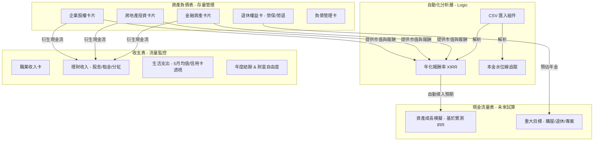

# 線上理財規劃書系統架構 (Management Reporting Edition)

## 1. 專案概述 (Overview)

本專案旨在構建一個互動式的「線上理財規劃書」。不同於傳統記帳，本系統採用**管理報表 (Management Reporting)** 邏輯，將資產依據「流動性」與「決策性質」進行分類，並透過自動化分析 CSV 交易數據，提供精準的年度報酬率與財務自由度試算。

* **技術棧：** VitePress (SSG) + Vue 3 + Element Plus。
* **核心理念：** 管理引導決策。區分「金融」、「房地產」、「企業」三大核心資產。
* **樣式原則：** **Zero Custom CSS**。嚴格限定使用 Element Plus 內建 Props 與 Utility Classes。

---

## 2. 核心資料流向 (Data Architecture)

系統採用單向資料流，由「資產存量」衍生「理財流量」，最終驗證「未來目標」。

---

## 3. 模組架構詳解 (Module Architecture)

### 3.1. 收支管理 (Income & Expense)

**定位：** 精準捕捉消費行為，並區分主/被動收入。

* **職業收入卡片：** 紀錄主動收入水位。
* **信用卡支出透視 (Credit Card Insight)：**
* **UI：** `el-tabs` 切換三張管理卡。
* **功能：** 計算過去 5 個月「平均開支」、「訂閱開支」、「專案開支」。

* **理財收入卡：** 分類顯示金融配息、房地產租金、企業分紅。

### 3.2. 資產負債表 (Management Reporting Cards)

**定位：** 核心管理區塊，採用三張獨立卡片區分不同決策性質。

#### **A. 金融投資資產卡 (Financial Assets)**

* **資料來源：** 支援 `庫存.CSV` 匯入。
* **核心指標：** 持有成本 (Principal)、目前市值、未實現盈虧。
* **自動化邏輯：** 排除 CSV 小計列，自動彙整 JPY/USD 多幣別。

#### **B. 房地產投資卡 (Real Estate)**

* **功能：** 管理非自住的投資物件。
* **關鍵欄位：** 銀行估值、租金投報率 (Yield)、房價預期增值率。
* **關聯性：** 與負債卡中的房貸連動。

#### **C. 企業/股權投資卡 (Business)**

* **功能：** 管理私人公司股權、合夥投資。
* **關鍵欄位：** 原始出資額、預計股利分紅、企業經營估值。

#### **D. 退休權益整合卡 (Retirement)**

* **UI：** 三層式設計。
* **層 1：** 退休後月領總額大字報。
* **層 2：** 勞保與勞退分欄對比。
* **層 3：** 距離目標退休金的缺口進度條 (`el-progress`)。

### 3.3. 現金流量表 (Financial Projections)

**定位：** 使用實測數據模擬生涯財富。

* **IRR 實測驅動：** 提供「實測年化 (如 17.5%)」與「保守市場平均」兩種模式切換。
* **重大目標事件：** 使用 `el-timeline` 標註未來大額專案支出。
* **黑字倒閉預警：** 若未來年度現金餘額低於緊急預備金，顯示 `el-tag` 警告。

---

## 4. 資料解析與分析邏輯 (Analytical Logic)

為了實現「一眼看懂賺多少」，系統需包含以下運算邏輯：

* **本金水位線追蹤：** 從 `交易.CSV` 提取買入總額，對比 `庫存.CSV` 的持有成本，確保本金計算不因交易損益而混淆。
* **XIRR 年化報酬率：** 結合資金進出日期與期末市值，算出過去一年的真實投資效率。
* **多幣別加權平均：** 自動處理 JPY/USD 匯率，提供單一基準幣別 (如 TWD) 的管理視角。

---

## 5. 全域組件與規範 (Global Standards)

* **`useFinancialFormatter`**: 處理貨幣符號、千分位及正負值顏色控制 (Green for profit, Red for loss)。
* **`ManagementCard`**: 統一封裝 `el-card`，要求具備 `header-slot` 用於放置幣別切換按鈕。
* **樣式禁令：** 禁止使用任何 `style="..."` 標籤或自定義 CSS，所有佈局透過 `el-row`, `el-col`, `el-space` 及內建 `margin/padding` utility classes 達成。

---

## 6. 開發優先級 (Roadmap)

1. **Phase 1 - 基礎解析：** 實作 CSV 匯入邏輯與「金融投資卡」的本金/盈虧展示。
2. **Phase 2 - 三卡鼎立：** 建立「房地產」與「企業投資」管理卡片，完善資產負債表。
3. **Phase 3 - 流量連動：** 根據資產卡的數據，自動生成收支表中的理財收入與財富自由度。
4. **Phase 4 - 生涯模擬：** 根據實測年化報酬率，跑出未來 30 年的現金流量趨勢圖。